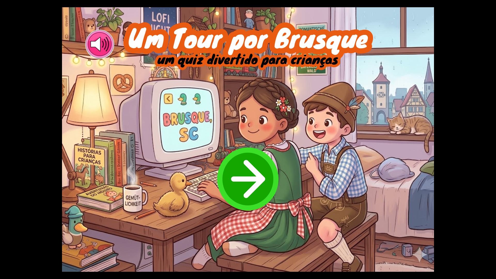
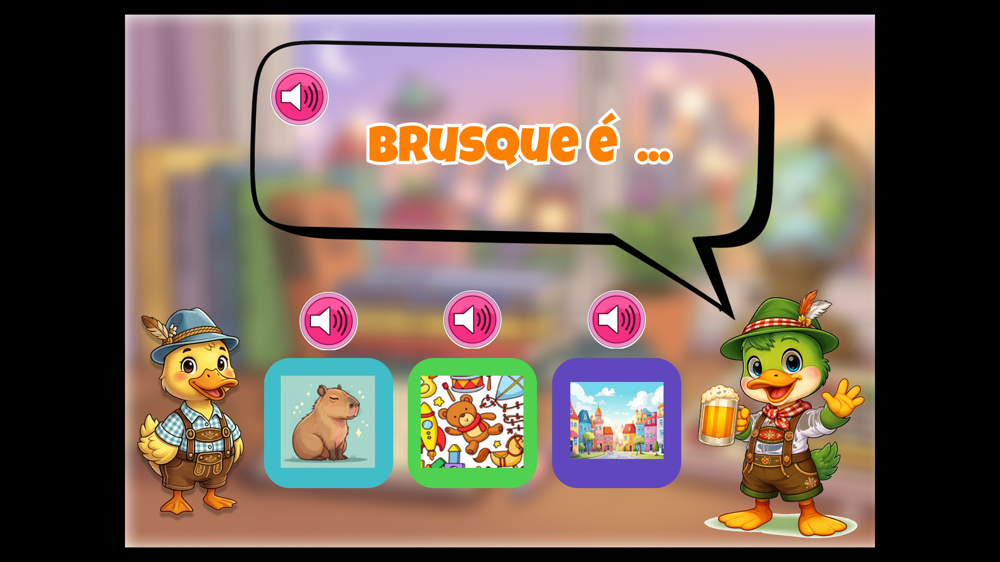
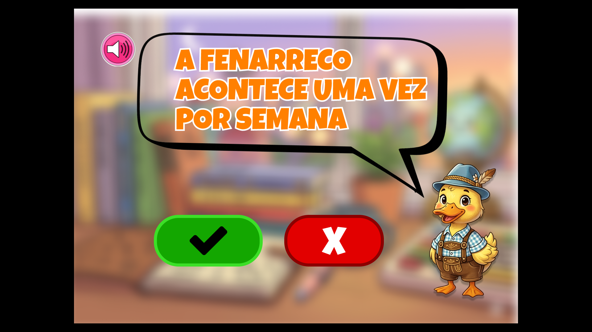
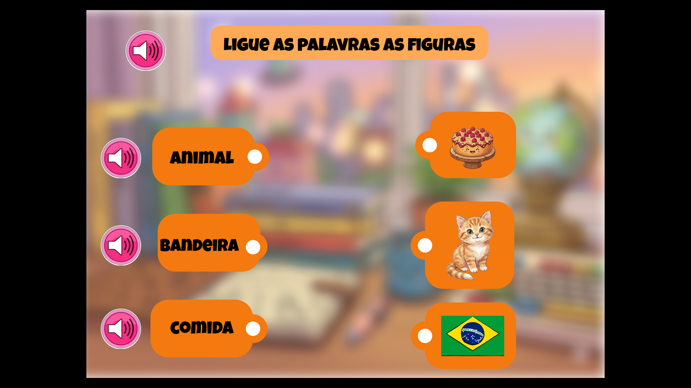
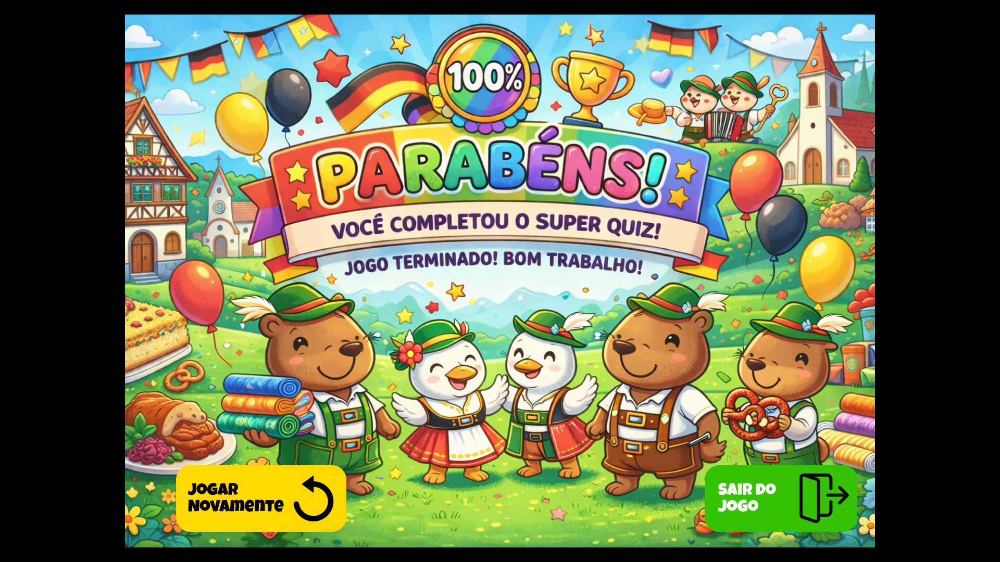

# Curricularizacão 2026 Atualizado
## Sobre o Projeto
Este é um projeto de curricularização com o propósito de ser um jogo didático infantil de 15 questões lúdicas para ensinar as crianças em periodo de pré-alfabetização sobre a cultura de Brusque. Este projeto foi planejado para que tanto o sua protipação e desenvolvimento fossem feito durante o periodo de 2 semanas. 
## Objetivos
-  Ter 15 questões
-  3 Dificuldades
-  3 tipos de questão
   - Verdadeiro ou Falso
   - Conecte as Figuras
   - Figura Correspondente
- Funcionar na Web
- Ser intuitivo para o público alvo
- Ser pertinente a cultura de Brusque
## Tecnologias
O projeto será feito primariamente de HTML e Css, com um pouco de JavaScript para funcionamento do jogo. as imagem e elementos gráficos serão feitas por IA ou livre de direitos autorais.
## Grupo
- Arthur Constantino Meurer
- Camilly Nau
- Edicley Machado 
- Gabriel Henrique da Silva
- Luis vitor 
  ## ABAIXO ALGUMAS IMAGENS DO NOSSO PROTÓTIPO FEITO NO FIGMA:

 <table>
  <td></td>
     </tr>
  </table> 
  <table>
     <tr>
<td></td> 
<td></td>
     </tr>
  </table>
    <table>
     <tr>
<td></td>
<td></td>
     </tr>
  </table>
